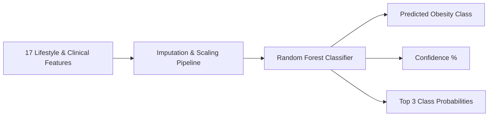

# 🩺 Obesity Management System (ObesityCare)
### *AI-Powered Clinical Obesity Assessment, Personalized Nutrition & Multi-Role Patient Care Platform*

[](https://nodejs.org/)
[](https://react.dev/)
[](https://python.org/)
[](https://flask.palletsprojects.com/)
[](https://scikit-learn.org/)
[](https://www.mongodb.com/atlas)
[](https://www.docker.com/)
[](http://localhost:5000/api-docs)

---

## 📖 Overview

The **Obesity Management System** is a full-stack clinical healthcare and nutrition platform designed to assist healthcare professionals, dietitians, and patients in assessing, monitoring, and managing obesity.

Built on a microservice architecture combining **Node.js/Express**, **React (Vite)**, and a **Python Flask Machine Learning Engine**, the platform enables data-driven clinical decision-making, automated personalized dietary planning, progress telemetry, and secure telehealth workflows.

---

## 🌟 Core Modules & Role-Based Portals

### 👨‍⚕️ 1. Doctor & Nutritionist Portal
- **AI Clinical Risk Assessment**: Evaluates 17 clinical and lifestyle parameters using a trained Random Forest model to predict multi-class obesity risk levels along with probability distributions.
- **Intelligent Meal Plan Generator**: Calculates personalized calorie targets (BMR/TDEE using Mifflin-St Jeor) and macronutrient ratios to generate tailored daily meal schedules.
- **Electronic Health Records (EHR)**: View patient clinical history, previous assessments, biometric logs, and consultation records.
- **Consultation Management**: Manage appointment requests, update status (*Scheduled, Completed, Cancelled*), and record consultation notes.

### 👤 2. Patient Portal
- **Health Dashboard**: Summary of current BMI, obesity tier, target weight, calorie allowance, and upcoming appointments.
- **Biometric Progress Tracking**: Log weight and track BMI trajectories over time with interactive visual charts.
- **Interactive Dietary Plans**: Daily breakdowns (Breakfast, Lunch, Dinner, Snacks) with portion guidelines.
- **Appointment Booking**: Request consultations with doctors and view status updates.

### 🛡️ 3. Administrator Portal
- **System Telemetry & Analytics**: KPI metrics tracking total patients, active medical staff, completed assessments, and consultations.
- **Doctor Provisioning**: Manage doctor accounts, assign specializations, and control access permissions.
- **Patient Directory Management**: Searchable patient database with account status controls.
- **Audit & Activity Reports**: Aggregate analytics for hospital operations and clinical reporting.

---

## 🧠 Machine Learning Classification Engine

The system integrates a **Scikit-Learn Random Forest Pipeline** hosted on an independent microservice.



### Input Feature Vector (17 Parameters):
| Category | Features |
| :--- | :--- |
| **Biometric Factors** | `Age`, `Gender`, `Height (m)`, `Weight (kg)` |
| **Dietary Patterns** | `FAVC` (Frequent high-calorie food), `FCVC` (Vegetable intake frequency), `NCP` (Number of main meals), `CAEC` (Food between meals), `CH2O` (Daily water intake) |
| **Physical & Habits** | `FAF` (Physical activity frequency), `TUE` (Screen time), `SMOKE`, `CALC` (Alcohol consumption), `MTRANS` (Transportation mode), `SCC` (Calorie monitoring) |
| **Hereditary & Scores** | `family_history_with_overweight`, `Physical_Activity_Score` |

### Output Target Classes:
1. `Insufficient_Weight`
2. `Normal_Weight`
3. `Overweight_Level_I`
4. `Overweight_Level_II`
5. `Obesity_Type_I`
6. `Obesity_Type_II`
7. `Obesity_Type_III`

---

## 🏗️ System Architecture

```
                                  +-----------------------+
                                  |     React SPA UI      |
                                  |   (Vite / Tailwind)   |
                                  +-----------+-----------+
                                              |
                                     HTTP / REST Calls
                                              |
                                              v
+-----------------------------------------------------------------------------------+
| Node.js / Express 5 API Gateway (Port 5000)                                       |
| - JWT Authentication & RBAC (Admin, Doctor, Patient)                             |
| - Swagger OpenAPI 3.0 Documentation (/api-docs)                                   |
| - Meal Planning, Progress Tracking & Appointment Services                         |
+--------------------+-------------------------------------+------------------------+
                     |                                     |
              Mongoose Driver                        Internal REST
                     |                                     |
                     v                                     v
+-----------------------------+        +--------------------------------------------+
|   MongoDB Atlas Database    |        | Python Flask ML Microservice (Port 5001)   |
|  - Users (Doctors/Patients) |        | - Random Forest Model (.joblib)            |
|  - Assessments & Meal Plans |        | - Endpoints: /predict, /health             |
|  - Appointments & Progress  |        | - scikit-learn, pandas, numpy              |
+-----------------------------+        +--------------------------------------------+
```

---

## 📂 Project Structure

```tree
obesity-management/
├── backend/                  # Node.js & Express REST API
│   ├── config/               # Database connection & DNS resilience
│   ├── controllers/          # Business logic (Admin, Doctor, Patient, Auth)
│   ├── docs/                 # Swagger API documentation setup
│   ├── middleware/           # JWT verification, Role-based auth guards
│   ├── models/               # Mongoose Schemas (User, Assessment, MealPlan, etc.)
│   ├── routes/               # API endpoint routing
│   ├── scripts/              # Seed scripts (Meal templates, Math verifications)
│   ├── Dockerfile            # Backend Docker image config
│   ├── package.json          # Node dependencies
│   └── index.js              # Express app entry point
├── frontend/                 # React Single Page Application (Vite)
│   ├── src/
│   │   ├── components/       # Shared UI components (Charts, Modals, Cards)
│   │   ├── layouts/          # Role-based Sidebar and Header layouts
│   │   ├── pages/            # Admin, Doctor, Patient screens
│   │   ├── services/         # Axios API clients & interceptors
│   │   ├── utils/            # Calculation utilities (BMI, BMR, Calorie targets)
│   │   ├── App.jsx           # Main routing with route guards
│   │   └── main.jsx          # React bootstrap
│   ├── Dockerfile            # Nginx production build
│   └── package.json          # Frontend dependencies
├── ml-service/               # Python Flask Machine Learning Service
│   ├── models/               # Trained Random Forest pipeline (.joblib)
│   ├── app.py                # Flask API server (/predict, /health)
│   ├── requirements.txt      # Python dependencies
│   └── Dockerfile            # Python 3.10 slim container
├── docker-compose.yml        # Multi-container orchestration config
├── package.json              # Monorepo concurrency scripts
└── README.md                 # Project documentation
```

---

## 🚀 Quick Setup & Installation

### 📋 Prerequisites
- **Node.js**: `v18.0.0+` ([Download](https://nodejs.org/))
- **Python**: `3.10+` ([Download](https://www.python.org/))
- **MongoDB Atlas** account (or local MongoDB)
- **Docker Desktop** *(Optional)*

---

### ⚙️ 1. Environment Configuration

Create a `.env` file in the `backend/` directory:

```env
PORT=5000
NODE_ENV=development

# MongoDB Atlas Connection
MONGODB_URI=mongodb+srv://<username>:<password>@cluster0.spixnwa.mongodb.net/obesity_management_db?retryWrites=true&w=majority

# JWT Authentication
JWT_SECRET=your_jwt_secret_key_minimum_32_characters
JWT_EXPIRES_IN=7d

# Machine Learning Service URL
ML_SERVICE_URL=http://localhost:5001
```

> [!NOTE]
> Make sure your current IP address is added to the **Network Access IP Whitelist** on [MongoDB Atlas](https://cloud.mongodb.com/) (or set to `0.0.0.0/0` for access from anywhere).

---

### 💻 2. Local Execution

Run all three services simultaneously from the root directory:

```bash
# 1. Install Node dependencies (root, backend, and frontend)
npm run install-all

# 2. Install Python ML requirements
pip install -r ml-service/requirements.txt

# 3. Seed Default Sri Lankan & International Meal Templates (Optional)
npm run seed:meals --prefix backend

# 4. Start Frontend, Backend, and ML services concurrently
npm run dev
```

#### Application Endpoints:
| Service | URL | Description |
| :--- | :--- | :--- |
| **Frontend Web App** | [http://localhost:5173](http://localhost:5173) | Vite React Dashboard |
| **Backend REST API** | [http://localhost:5000](http://localhost:5000) | Express API Server |
| **Swagger API Docs** | [http://localhost:5000/api-docs](http://localhost:5000/api-docs) | Interactive API documentation |
| **ML Inference Service** | [http://localhost:5001](http://localhost:5001) | Flask ML API |

---

### 🐳 3. Docker Compose Setup

Run the entire system in isolated Docker containers:

```bash
# Build and run containers in background
docker-compose up --build -d

# View service logs
docker-compose logs -f

# Stop containers
docker-compose down
```

---

## 📡 API Endpoint Summary

Interactive documentation and testing are available via Swagger UI at `http://localhost:5000/api-docs`.

### Primary API Routes:
```http
# Authentication
POST /api/auth/register             # Register patient account
POST /api/auth/login                # Authenticate and receive JWT token
POST /api/auth/forgot-password      # Initiate password reset

# Doctor & Assessment Services
POST /api/doctor/assessments        # Submit 17 features & receive ML prediction
GET  /api/doctor/assessments/:id    # Get assessment report & risk distribution
POST /api/doctor/meal-plans         # Generate customized meal plan
GET  /api/doctor/patients           # Get doctor's assigned patient roster

# Patient Health Services
GET  /api/patient/dashboard         # Summary of patient vitals & appointments
POST /api/patient/progress          # Log weight & track BMI progress
GET  /api/patient/meal-plans        # View assigned meal plans & daily targets

# Administration
GET  /api/admin/dashboard/stats     # System-wide metrics and stats
GET  /api/admin/doctors             # Manage doctor accounts
POST /api/admin/doctors             # Register new doctor profile
```

---

## 🔒 Security & Quality Standards

- **Role-Based Access Control (RBAC)**: Secure access gating for `Admin`, `Doctor`, and `Patient` roles.
- **Secure Password Storage**: Bcrypt hashing with salted passwords.
- **Resilient Database Connection**: Automatic DNS fallback and graceful retry mechanisms for MongoDB Atlas connections.
- **Input Sanitization**: Schema validation on both client and server layers.

---

## 📄 License

This project is licensed under the **ISC License** - see the [package.json](file:///g:/Project/obesity-management/package.json) file for details.

---

<p align="center">
  <b>Obesity Management System</b> — AI-Powered Healthcare Platform<br>
  Built with React, Express, Python & MongoDB
</p>
