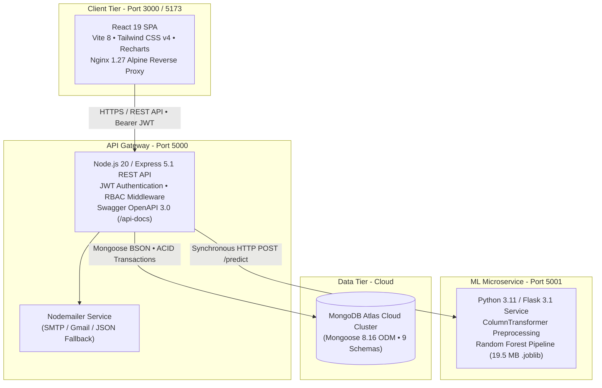
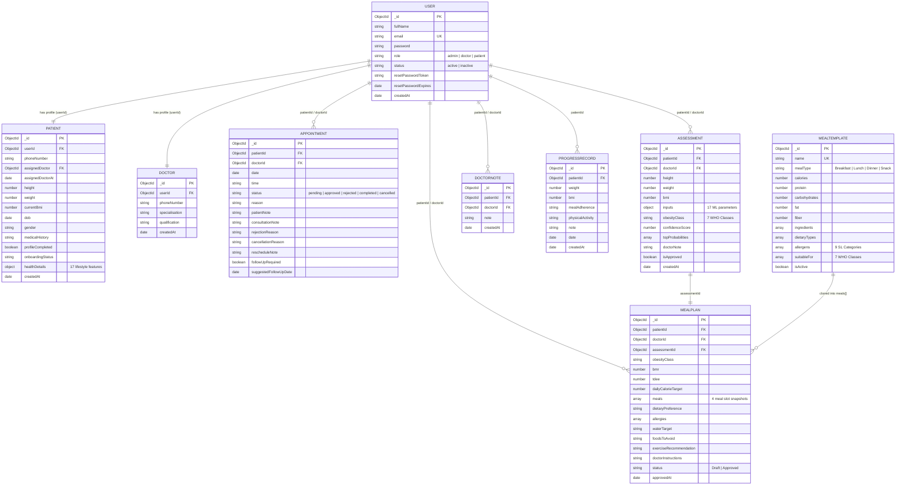
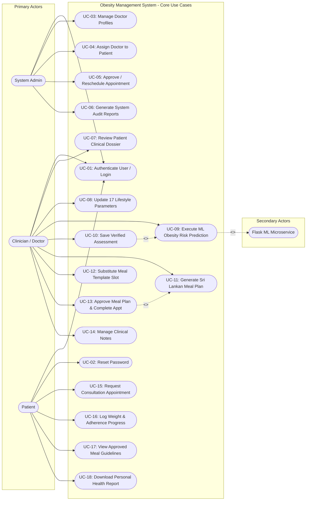
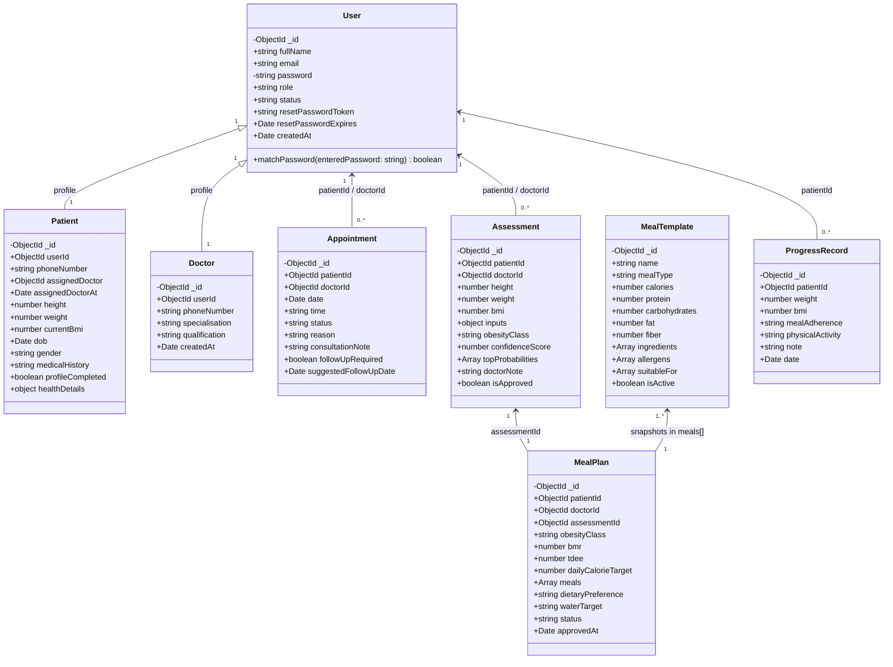
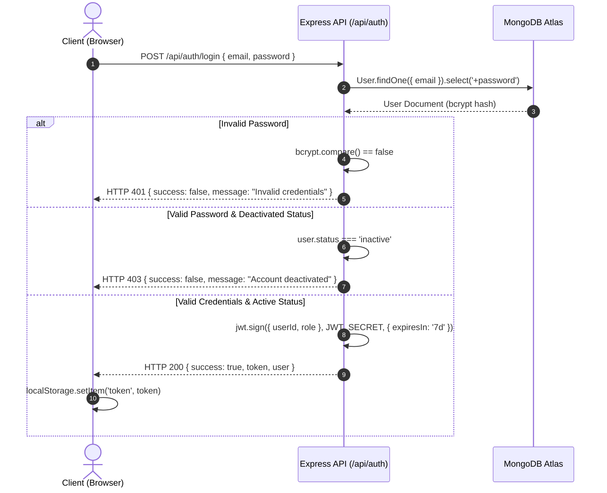
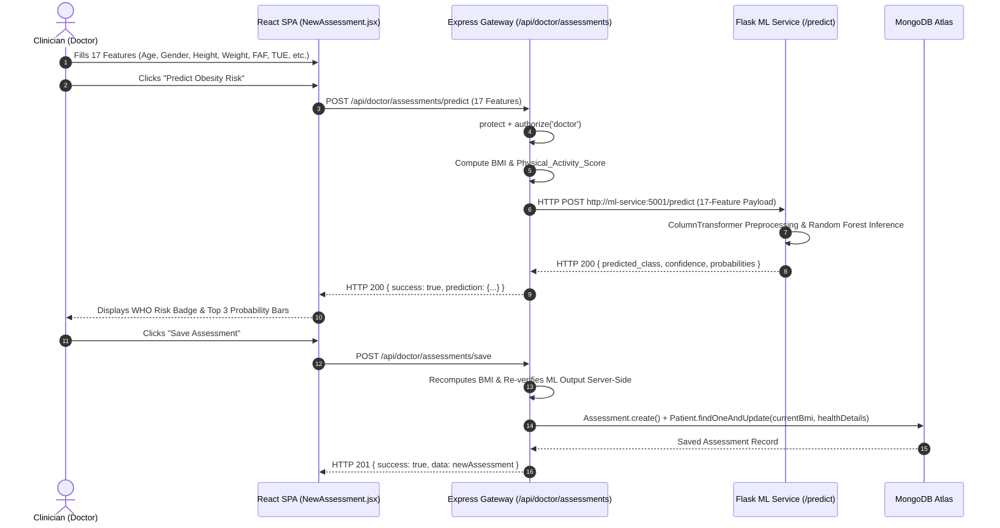
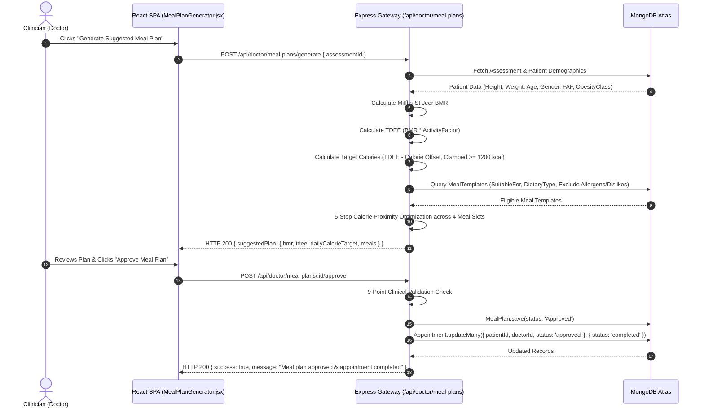
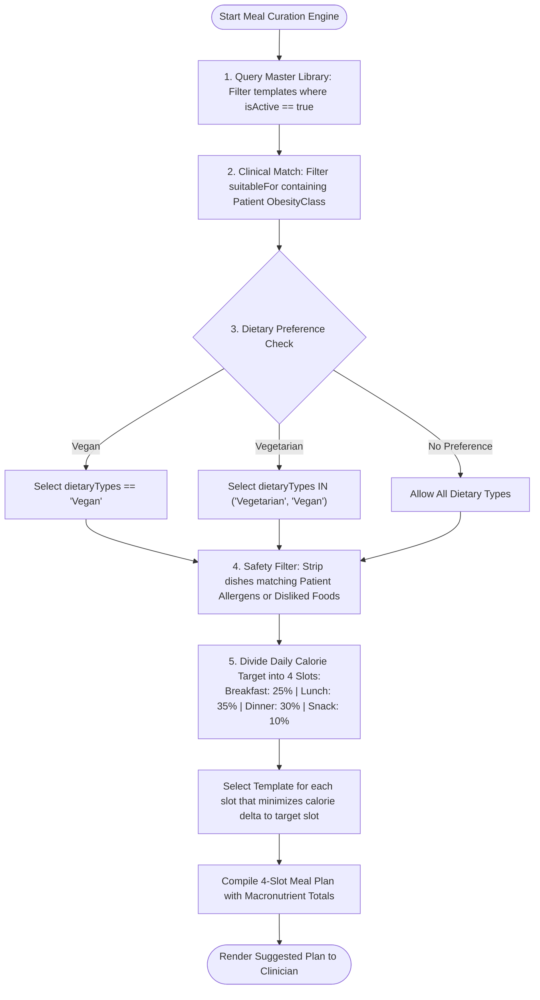
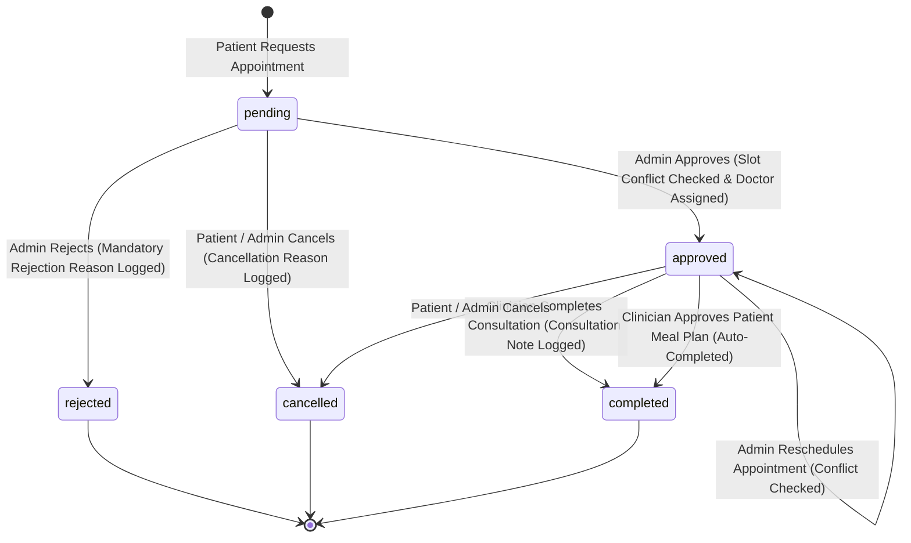
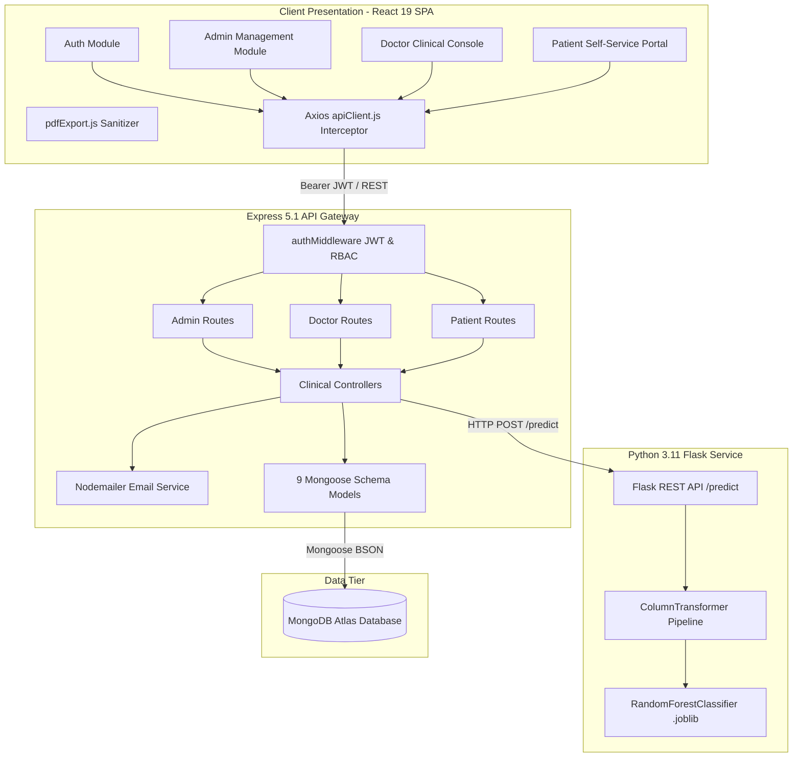

<div align="center">

# 🏥 Obesity Management System
### *AI-Powered Clinical Decision Support & Sri Lankan Dietary Management Platform*

[](https://github.com/Kavindu1998knw/obesity-management/actions/workflows/ci.yml)
[](https://nodejs.org/)
[](https://react.dev/)
[](https://expressjs.com/)
[](https://python.org/)
[](https://scikit-learn.org/)
[](https://tailwindcss.com/)
[](https://www.mongodb.com/)
[](https://www.docker.com/)
[](http://localhost:5000/api-docs)

<p align="center">
  <strong>Final-Year Software Engineering Degree Project</strong><br>
  <strong>Cardiff Metropolitan University &bull; Cardiff School of Technology</strong>
</p>

<p align="center">
  <a href="#-system-architecture">Architecture</a> &bull;
  <a href="#-comprehensive-system-diagrams-uml--architectural-blueprints">System Diagrams (UML)</a> &bull;
  <a href="#-core-modules--features">Features</a> &bull;
  <a href="#-machine-learning-intelligence-tier">Machine Learning</a> &bull;
  <a href="#-nutritional--clinical-energy-engine">Nutritional Engine</a> &bull;
  <a href="#-quick-start--installation">Quick Start</a> &bull;
  <a href="#-rest-api-documentation">API Docs</a> &bull;
  <a href="#-docker--devops">DevOps & CI/CD</a>
</p>

---

</div>

## 📌 Executive Summary

The **Obesity Management System (OMS)** is a cloud-native, three-tier healthcare software ecosystem engineered to modernize outpatient obesity diagnosis, clinical risk stratification, and personalized dietary planning. 

Traditional clinical practice relies almost exclusively on solitary **Body Mass Index (BMI)** metrics and generic, paper-based diet sheets that fail to account for multi-factorial lifestyle behaviors or native culinary habits. The **OMS platform** solves these limitations by combining:

1. **A Supervised Machine Learning Classifier (Random Forest):** Evaluates 17 physiological and behavioral features (including an engineered composite *Physical Activity Score*) to predict 7 World Health Organization (WHO) obesity risk classes with **$94.26\%$ accuracy** and **$94.43\%$ 10-fold cross-validation F1-score**.
2. **An Automated Bio-Energetic Nutritional Engine:** Implements the clinical **Mifflin-St Jeor** Basal Metabolic Rate (BMR) formulation and Total Daily Energy Expenditure (TDEE) multipliers to curate balanced daily meal plans from a custom database of **56 authentic Sri Lankan meal templates** with 9 allergen filters and calorie proximity optimization.
3. **Role-Based Workflow Automation:** Provides distinct, secure portals for **System Administrators**, **Clinicians (Doctors)**, and **Patients**, featuring anti-double-booking appointment scheduling, longitudinal weight/BMI progress tracking, and client-side color-gamut sanitized PDF clinical reporting.

---

## 🏗️ System Architecture

The application is structured as a decoupled, containerized three-tier microservices architecture operating over an isolated Docker bridge network (`obesity-network`):



---

## 📐 Comprehensive System Diagrams (UML & Architectural Blueprints)

### 1. Entity-Relationship (ER) Diagram (9 Mongoose Models)



---

### 2. System Use Case Diagram



---

### 3. Domain Class Diagram (Models & Core Controllers)



---

### 4. Sequence Diagrams (Core Workflows)

#### A. Sequence Diagram: Authentication & Session Verification



#### B. Sequence Diagram: Machine Learning Obesity Risk Prediction



#### C. Sequence Diagram: Automated Sri Lankan Meal Plan Generation & Approval



---

### 5. Activity Diagrams (Clinical & Algorithmic Workflows)

#### A. Activity Diagram: 5-Step Sri Lankan Meal Curation Algorithm



---

### 6. State Machine Diagram: Appointment Lifecycle Management



---

### 7. Component & Infrastructure Topology Diagram



---

### 8. Deployment Node Diagram (Docker Container Bridge Network)

```mermaid
graph TD
    subgraph Host_Machine [Production Server / Local Host]
        subgraph Docker_Engine [Docker Bridge Network: obesity-network]
            
            subgraph Node_Frontend [Container: obesity-frontend]
                NGINX[Nginx 1.27 Alpine Web Server<br/>Port 80 (Internal)<br/>Mapped to Host: 3000, 5173]
                BUILD[Compiled React 19 Static Bundle]
                NGINX --> BUILD
            end

            subgraph Node_Backend [Container: obesity-backend]
                NODE[Node.js 20 Alpine Runtime<br/>Express 5.1.0 Gateway<br/>Port 5000 (Internal & Host)]
            end

            subgraph Node_ML [Container: obesity-ml-service]
                PYTHON[Python 3.11 Slim Runtime<br/>Flask 3.1.1 Microservice<br/>Port 5001 (Internal & Host)]
                MODEL_FILE[final_obesity_random_forest_pipeline.joblib]
                PYTHON --> MODEL_FILE
            end

        end

        subgraph Cloud_Tier [External Cloud Services]
            ATLAS[(MongoDB Atlas Cloud Replica Set)]
            SMTP[SMTP / Gmail Mail Relay]
        end

    end

    NGINX -->|Reverse Proxy /api| NODE
    NODE -->|Internal HTTP :5001| PYTHON
    NODE -->|TLS / Mongoose Connection| ATLAS
    NODE -->|TLS Port 587| SMTP
```

---

## 🌟 Core Modules & Features

```
+----------------------------------------------------------------------------------------------------+
|                                    ROLE-BASED SYSTEM PORTALS                                       |
+------------------------------------+-----------------------------------+---------------------------+
| 🛡️ SYSTEM ADMINISTRATOR            | 🩺 CLINICIAN (DOCTOR)             | 👤 PATIENT                |
+------------------------------------+-----------------------------------+---------------------------+
| &bull; Doctor Account Provisioning       | &bull; Patient Clinical Dossier         | &bull; Self-Registration & Auth   |
| &bull; Welcome Email Credentials Dispatch| &bull; 17-Feature Health Updating       | &bull; Appointment Booking Slot   |
| &bull; Doctor & Patient Status Toggling  | &bull; ML Obesity Risk Prediction (94%) | &bull; Approved Meal Plan Reviews |
| &bull; Patient-Doctor Assignment         | &bull; BMR/TDEE Meal Plan Generator     | &bull; Macro & Calorie Breakdown  |
| &bull; Anti-Conflict Appt Approval       | &bull; Slot-by-Slot Meal Substitution   | &bull; Substitute Meal Discovery  |
| &bull; Conflict-Free Appt Rescheduling   | &bull; Strict 9-Point Plan Approval     | &bull; Daily Weight & Compliance  |
| &bull; Transactional Account Deletions   | &bull; Multi-Author Clinical Notes      | &bull; Interactive BMI Trend Line |
| &bull; 5 System-Wide Audit PDF Reports   | &bull; Consultation Completion Workflow | &bull; Sanitized PDF Health Export|
| &bull; Real-Time KPI Analytics Dashboard | &bull; 4 Clinical Patient Reports (PDF) | &bull; Instant Status Tracking    |
+------------------------------------+-----------------------------------+---------------------------+
```

---

## 🧠 Machine Learning Subsystem

* **Algorithm:** `RandomForestClassifier` (scikit-learn `1.6.1` Pipeline serialized via `joblib` into a 19.5 MB model binary).
* **Dataset:** UCI Obesity Levels dataset ($N=2,087$ clean records across 17 features).
* **Engineered Feature:** $\text{Physical\_Activity\_Score} = (\text{FAF} \times 3) + \left(1 - \frac{\text{TUE}}{24}\right) \times 2$.
* **Classification Targets (7 WHO Classes):** `Insufficient_Weight`, `Normal_Weight`, `Overweight_Level_I`, `Overweight_Level_II`, `Obesity_Type_I`, `Obesity_Type_II`, `Obesity_Type_III`.

### Empirical Test Performance ($N=418$ Test Instances)

| Obesity Risk Category | Precision | Recall | F1-Score | Support |
|---|---|---|---|---|
| `Insufficient_Weight` | $1.0000$ | $0.9434$ | **$0.9709$** | 53 |
| `Normal_Weight` | $0.7714$ | $0.9474$ | **$0.8504$** | 57 |
| `Overweight_Level_I` | $0.9216$ | $0.8545$ | **$0.8868$** | 55 |
| `Overweight_Level_II` | $0.9286$ | $0.8966$ | **$0.9123$** | 58 |
| `Obesity_Type_I` | $1.0000$ | $0.9571$ | **$0.9781$** | 70 |
| `Obesity_Type_II` | $1.0000$ | $1.0000$ | **$1.0000$** | 60 |
| `Obesity_Type_III` | $1.0000$ | $0.9846$ | **$0.9922$** | 65 |
| **Overall Accuracy** | — | — | **$94.26\%$** | 418 |
| **Macro-Averaged F1** | **$94.59\%$** | **$94.05\%$** | **$94.15\%$** | 418 |
| **10-Fold Stratified CV F1** | — | — | **$94.43\%$** | 2,087 |

---

## 🥗 Nutritional & Clinical Energy Engine

1. **Body Mass Index (BMI):** $\text{BMI} = \frac{\text{Weight (kg)}}{(\text{Height (m)})^2}$
2. **Basal Metabolic Rate (Mifflin-St Jeor):**
   * $\text{BMR}_{\text{Male}} = (10 \times W_{\text{kg}}) + (6.25 \times H_{\text{cm}}) - (5 \times A) + 5$
   * $\text{BMR}_{\text{Female}} = (10 \times W_{\text{kg}}) + (6.25 \times H_{\text{cm}}) - (5 \times A) - 161$
3. **Total Daily Energy Expenditure (TDEE):** $\text{TDEE} = \text{BMR} \times \text{Activity Factor}$ ($1.20$ to $1.725$).
4. **Caloric Adjustment by Class:** Insufficient ($+300$), Normal ($0$), Overweight I ($-300$), Overweight II ($-400$), Obesity I/II/III ($-500$), clamped to $\ge 1200\text{ kcal}$.
5. **Daily Meal Split:** Breakfast ($25\%$), Lunch ($35\%$), Dinner ($30\%$), Snack ($10\%$).
6. **Sri Lankan Meal Library:** 56 seeded native dishes (Red Rice Milk Rice, String Hoppers, Kurakkan Pittu, Pol Roti, Dhal Curry, Fish Ambul Thiyal, etc.) with 9 allergen filters and medical warning tags.

---

## 📁 Repository Structure

```
obesity-management/
├── .github/
│   └── workflows/
│       └── ci.yml                          # 4-stage GitHub Actions CI pipeline
├── backend/
│   ├── config/
│   │   └── dbConnection.js                 # Mongoose connection with timeout handling
│   ├── controllers/                        # 13 REST API controllers (~4,500 lines)
│   ├── docs/
│   │   └── swagger.js                      # OpenAPI 3.0.3 documentation (2,728 lines)
│   ├── middleware/
│   │   └── authMiddleware.js               # JWT verification & RBAC authorization
│   ├── models/                             # 9 Mongoose schemas (User, Patient, Doctor, Appt, etc.)
│   ├── routes/                             # 13 Express route files (53 endpoints)
│   ├── scripts/
│   │   ├── seedMealTemplates.js            # Seeds 56 authentic Sri Lankan meal templates
│   │   ├── testSchema.js                   # Mongoose schema validation tests
│   │   └── verifyMath.js                   # BMR / TDEE mathematical calculation validator
│   ├── services/
│   │   └── emailService.js                 # Nodemailer credentials dispatcher
│   ├── Dockerfile                          # Node.js 20 Alpine production image
│   └── index.js                            # Express server entry point
├── frontend/
│   ├── public/                             # Favicons and SVG sprite assets
│   ├── src/
│   │   ├── components/                     # 11 reusable components and admin modals
│   │   ├── layouts/
│   │   │   └── DashboardLayout.jsx         # App shell with in-DOM logout confirmation
│   │   ├── pages/                          # 24 React page views across 3 roles
│   │   ├── router/
│   │   │   └── AppRouter.jsx               # React Router v7 routes & protected guards
│   │   ├── services/
│   │   │   └── apiClient.js                # Axios client with auto 401/403 interceptors
│   │   ├── utils/
│   │   │   └── pdfExport.js                # 363-line modern CSS gamut sanitizer for PDF
│   │   └── index.css                       # Tailwind CSS v4 stylesheets
│   ├── Dockerfile                          # Multi-stage build (Node 20 -> Nginx 1.27)
│   ├── nginx.conf                          # Production Nginx SPA routing & Gzip
│   └── vite.config.js                      # Vite 8 configuration
├── ml-service/
│   ├── models/
│   │   └── final_obesity_random_forest_pipeline.joblib # Serialized 19.5 MB Random Forest
│   ├── app.py                              # Flask 3.1 inference microservice (Port 5001)
│   ├── Dockerfile                          # Python 3.11 Slim production image
│   └── requirements.txt                    # ML dependencies
├── docker-compose.yml                      # 3-tier container orchestration
├── package.json                            # Root concurrently script runner
└── README.md                               # Project documentation
```

---

## 🛠️ Complete Technology Stack

| Layer / Domain | Technology | Exact Version | Primary Responsibility |
|---|---|---|---|
| **Frontend UI** | React | `^19.2.7` | Component-based reactive user interface |
| **Frontend Bundler** | Vite | `^8.1.0` | Hot Module Replacement (HMR) & production build |
| **CSS Framework** | Tailwind CSS | `^4.3.1` | Modern utility styling via `@tailwindcss/vite` |
| **Routing** | React Router DOM | `^7.18.0` | Client-side routing and protected route guards |
| **HTTP Client** | Axios | `^1.18.1` | Interceptor-managed API communication |
| **Charts** | Recharts | `^3.10.1` | Interactive analytics and progress trend lines |
| **Icons & Animation** | Lucide / Framer Motion | `^1.33` / `^12.41` | Modern iconography and micro-interactions |
| **PDF Generation** | html2pdf.js | `^0.14.0` | Client-side clinical PDF document generation |
| **Linter** | Oxlint | `^1.69.0` | High-speed static code quality analysis |
| **Backend Runtime** | Node.js | `20-alpine` | Server execution environment |
| **Backend Framework** | Express | `^5.1.0` | REST API with native async error handling |
| **Database ODM** | Mongoose | `^8.16.0` | MongoDB Object Data Modeling & validation |
| **Authentication** | JSON Web Token | `^9.0.2` | Signed bearer token issuance & verification |
| **Password Hashing** | BcryptJS | `^3.0.2` | 12-round salted password hashing |
| **Email Service** | Nodemailer | `^7.0.7` | SMTP credentials & notification dispatch |
| **API Docs** | Swagger UI Express | `^5.0.1` | OpenAPI 3.0 interactive documentation |
| **ML Microservice** | Python / Flask | `3.11` / `3.1.1` | Synchronous ML inference service (Port 5001) |
| **ML Libraries** | Scikit-learn / Pandas | `1.6.1` / `2.2.3` | Random Forest pipeline & feature engineering |
| **Database** | MongoDB Atlas | Cluster 8.16 | Cloud replica set database |
| **Containers** | Docker & Compose | Compose v2 | Multi-container bridge network deployment |
| **Web Server** | Nginx | `1.27-alpine` | Production frontend hosting & Gzip proxy |

---

## 🚀 Quick Start & Installation

### 📋 Prerequisites
* **Node.js** (v20 LTS recommended)
* **Python** (v3.11 recommended)
* **MongoDB** (Local instance or MongoDB Atlas URI)
* **Git**

---

### ⚙️ Local Development Setup (Concurrently)

1. **Clone the Repository:**
   ```bash
   git clone https://github.com/Kavindu1998knw/obesity-management.git
   cd obesity-management
   ```

2. **Install Root, Backend, and Frontend Dependencies:**
   ```bash
   npm install
   npm run install-all
   ```

3. **Install Python ML Service Dependencies:**
   ```bash
   cd ml-service
   pip install -r requirements.txt
   cd ..
   ```

4. **Configure Environment Variables:**
   * Create `backend/.env` from `.env.example`:
     ```bash
     cp backend/.env.example backend/.env
     ```
   * Populate required variables:
     ```env
     PORT=5000
     MONGODB_URI=mongodb+srv://<username>:<password>@cluster.mongodb.net/obesity_management_db
     JWT_SECRET=your_secure_jwt_secret_key_here
     ML_SERVICE_URL=http://localhost:5001
     ```

5. **Seed the 56 Authentic Sri Lankan Meal Templates:**
   ```bash
   npm run seed:meals
   ```

6. **Start All 3 Tiers Concurrently:**
   ```bash
   npm run dev
   ```

| Service | Local URL | Description |
|---|---|---|
| **Frontend Client** | [http://localhost:5173](http://localhost:5173) | React 19 SPA Development Server |
| **Express API Gateway** | [http://localhost:5000](http://localhost:5000) | REST API Server |
| **Swagger API Docs** | [http://localhost:5000/api-docs](http://localhost:5000/api-docs) | Interactive OpenAPI 3.0 UI |
| **Flask ML Microservice** | [http://localhost:5001](http://localhost:5001) | Python Random Forest Inference Service |

---

### 🐳 Running via Docker Compose

To launch the complete three-tier containerized stack in an isolated bridge network:

```bash
docker compose up --build
```

* **Frontend SPA (Nginx):** [http://localhost:3000](http://localhost:3000) or [http://localhost:5173](http://localhost:5173)
* **Backend Express Server:** [http://localhost:5000](http://localhost:5000)
* **Flask ML Microservice:** [http://localhost:5001](http://localhost:5001)
* **Swagger API Explorer:** [http://localhost:5000/api-docs](http://localhost:5000/api-docs)

---

## 📖 REST API Documentation

The backend REST API provides **53 fully implemented endpoints**. Interactive documentation is accessible via Swagger UI at **[http://localhost:5000/api-docs](http://localhost:5000/api-docs)**.

```
+----------------------------------------------------------------------------------------------------+
|                                    API ENDPOINTS OVERVIEW                                          |
+----------------------------------------------------------------------------------------------------+
| PUBLIC & AUTHENTICATION:                                                                           |
|   GET  /                                  -> Health check response                                 |
|   GET  /api-docs.json                     -> OpenAPI 3.0.3 specification JSON                      |
|   POST /api/auth/register                 -> Patient self-registration                             |
|   POST /api/auth/login                    -> Authenticate user & issue 7-day JWT                   |
|   POST /api/auth/reset-password           -> Token-verified password reset                         |
|                                                                                                    |
| DASHBOARDS & ANALYTICS:                                                                            |
|   GET  /api/dashboard/admin               -> System-wide analytics & 6-month trends                |
|   GET  /api/dashboard/doctor              -> Clinician caseload & appointment stats                |
|   GET  /api/dashboard/patient             -> Personal health summary & BMI trajectory              |
|                                                                                                    |
| ADMIN MANAGEMENT:                                                                                  |
|   GET/POST   /api/admin/doctors           -> List / Create doctor profiles                         |
|   GET/PUT/DEL/api/admin/doctors/:id       -> View / Update / Safe Delete doctor                    |
|   PATCH      /api/admin/doctors/:id/status-> Toggle doctor active/inactive status                  |
|   GET/DEL    /api/admin/patients/:id      -> View dossier / Safe Delete patient                    |
|   PATCH      /api/admin/patients/:id/status-> Toggle patient active/inactive status                |
|   PATCH      /api/admin/patients/:id/assign-doctor -> Assign doctor to patient                     |
|   GET        /api/admin/appointments      -> Global multi-criteria appointment list                |
|   PATCH      /api/admin/appointments/:id/status -> Approve / Reject appointment                    |
|   PUT        /api/admin/appointments/:id/reschedule -> Conflict-checked rescheduling               |
|   POST       /api/admin/reports/generate  -> Generate 5 administrative audit reports (PDF)         |
|                                                                                                    |
| DOCTOR CLINICAL MODULES:                                                                           |
|   GET        /api/doctor/patients         -> List assigned patients                                |
|   GET/PUT    /api/doctor/patients/:id     -> Patient dossier / Update 17 lifestyle parameters      |
|   POST/PUT   /api/doctor/patients/:id/notes-> Create / Edit doctor consultation notes              |
|   GET/PUT    /api/doctor/appointments     -> Schedule view / Complete consultation                 |
|   GET/POST   /api/doctor/assessments      -> List / Execute ML prediction & save assessment        |
|   GET/POST   /api/doctor/meal-plans       -> List / Generate BMR-TDEE Sri Lankan meal plans        |
|   POST       /api/doctor/meal-plans/alternatives -> Substitute individual meal template slot       |
|   POST       /api/doctor/meal-plans/:id/approve -> Approve meal plan & auto-complete appointment   |
|   GET        /api/doctor/reports/generate -> Generate 4 clinical patient reports (PDF)             |
|                                                                                                    |
| PATIENT SELF-MANAGEMENT:                                                                           |
|   GET/POST   /api/patient/appointments    -> View appointments / Request consultation              |
|   PUT        /api/patient/appointments/:id/cancel -> Cancel pending appointment                   |
|   GET        /api/patient/assessments     -> Review historical obesity risk assessments            |
|   GET        /api/patient/meal-plans      -> Access approved daily meal plans & recipes            |
|   GET/POST/PUT /api/patient/progress      -> View / Log / Update daily weight & adherence          |
|   GET        /api/patient/reports/generate-> Download personal health summary reports (PDF)        |
+----------------------------------------------------------------------------------------------------+
```

---

## 🧪 Testing & Validation

The codebase includes dedicated offline validation scripts and linting tools:

* **Validate BMR / TDEE Nutritional Calculations:**
  ```bash
  node backend/scripts/verifyMath.js
  ```
* **Validate Mongoose Schema Constraints & Rejections:**
  ```bash
  node backend/scripts/testSchema.js
  ```
* **Run Frontend Static Code Analysis:**
  ```bash
  cd frontend && npm run lint
  ```

---

## 👨‍💻 Author & Academic Attribution

* **Author:** **Kavindu Weerasinghe**
* **Student ID:** `GM/BSCSD/06/11`
* **Degree:** Bachelor of Science (Hons) in Software Engineering
* **University:** Cardiff Metropolitan University (Cardiff School of Technology)
* **Supervisor:** Academic Project Faculty

*This repository contains the complete source code and technical implementation for the final-year software engineering dissertation.*
