<p align="center">
  <h1 align="center">🏥 Smart Obesity AI</h1>
  <p align="center">
    <strong>Hospital Dietary & Obesity Management System with ML-Powered Prediction</strong>
  </p>
  <p align="center">
    A full-stack web application for clinical obesity management, featuring machine learning-based obesity risk classification, personalized meal plan generation, patient progress tracking, and comprehensive multi-role dashboards.
  </p>
</p>

<p align="center">
  
  
  
  
  
  
  
</p>

---

## 📋 Table of Contents

- [Overview](#-overview)
- [System Architecture](#-system-architecture)
- [Technology Stack](#-technology-stack)
- [Features](#-features)
- [Use Cases](#-use-cases)
- [Database Design](#-database-design)
- [API Reference](#-api-reference)
- [System Workflows](#-system-workflows)
  - [Authentication Flow](#1-authentication-sequence)
  - [Obesity Prediction Flow](#2-obesity-prediction-sequence)
  - [Appointment Workflow](#3-appointment-workflow-sequence)
  - [Health Record Flow](#4-health-record--progress-tracking-sequence)
  - [Meal Plan Generation Flow](#5-meal-plan-generation-sequence)
- [Machine Learning Module](#-machine-learning-module)
- [Health Calculation Engine](#-health-calculation-engine)
- [Meal Plan Generation System](#-meal-plan-generation-system)
- [Software Components](#-software-components)
- [Data Flow](#-data-flow)
- [Getting Started](#-getting-started)
- [Environment Variables](#-environment-variables)
- [Deployment](#-deployment)
- [CI/CD Pipeline](#-cicd-pipeline)
- [Project Structure](#-project-structure)
- [Feature Workflow](#-feature-workflow)
- [Diagram Verification](#-diagram-verification)

---

## 🔍 Overview

**Smart Obesity AI** is a web-based hospital dietary and obesity management system designed as a clinical decision-support tool. The platform connects three user roles — **Administrators**, **Doctors**, and **Patients** — through a unified interface for obesity assessment, prediction, dietary planning, and health monitoring.

### Key Capabilities

- **ML-Powered Obesity Classification** — 7-class prediction using a pre-trained Random Forest pipeline with 17 clinical/lifestyle features
- **Personalized Meal Plan Generation** — Rule-based engine calculating BMR/TDEE with dietary preference, allergy, and obesity-class-aware meal selection
- **Patient Progress Tracking** — Weight and BMI logging with historical trend visualization
- **Appointment Management** — Full lifecycle workflow with state-transition validation
- **Multi-Role Dashboards** — Real-time analytics with charts and summary metrics for each role
- **Report Generation** — Multiple report types per role with client-side PDF export
- **API Documentation** — Swagger UI with OpenAPI 3.0.3 specification

---

## 🏗 System Architecture

### System Architecture Diagram

> Source: `docker-compose.yml`, `backend/index.js`, `ml-service/app.py`, `frontend/src/services/apiClient.js`, `frontend/src/router/AppRouter.jsx`

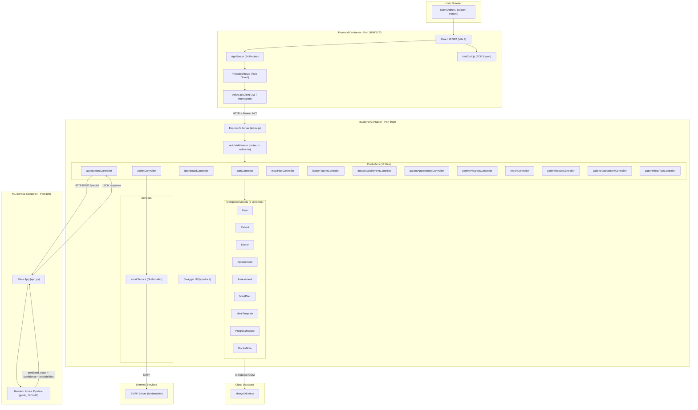

### Architecture Pattern

**Modular Monolith + Separate ML Microservice** — The backend follows a Model-View-Controller (MVC) pattern with Express middleware chains for authentication and authorization. The ML inference service is decoupled as a separate Flask microservice communicating via HTTP/JSON.

---

## 🛠 Technology Stack

### Frontend
| Technology | Version | Purpose |
|---|---|---|
| React | 19.2.7 | Component-based UI framework |
| Vite | 8.1.0 | Build tool and development server |
| React Router DOM | 7.18.0 | Client-side SPA routing |
| TailwindCSS | 4.3.1 | Utility-first CSS framework |
| Axios | 1.18.1 | HTTP client with interceptors |
| Recharts | 3.10.1 | Data visualization and charting |
| Framer Motion | 12.41.0 | Animation library |
| Lucide React | 1.33.0 | Icon library |
| html2pdf.js | 0.14.0 | Client-side PDF generation |
| Oxlint | 1.69.0 | Fast JavaScript/TypeScript linter |

### Backend
| Technology | Version | Purpose |
|---|---|---|
| Node.js | 20.x (LTS) | JavaScript runtime |
| Express | 5.2.1 | Web application framework |
| Mongoose | 9.7.2 | MongoDB object data modeling |
| bcryptjs | 3.0.3 | Password hashing (salt rounds: 12) |
| jsonwebtoken | 9.0.3 | JWT authentication tokens |
| Nodemailer | 9.0.5 | Transactional email service |
| swagger-ui-express | 5.0.1 | Interactive API documentation |
| cors | 2.8.6 | Cross-Origin Resource Sharing |

### Machine Learning
| Technology | Version | Purpose |
|---|---|---|
| Python | 3.11 | ML runtime |
| Flask | 3.1.1 | Lightweight web framework |
| scikit-learn | 1.6.1 | ML model framework |
| pandas | 2.2.3 | Data manipulation |
| joblib | 1.4.2 | Model serialization |
| NumPy | 2.2.6 | Numerical computing |

### Infrastructure
| Technology | Purpose |
|---|---|
| MongoDB Atlas | Cloud-hosted NoSQL database |
| Docker + Docker Compose | Multi-container orchestration |
| Nginx 1.27 | Production static file server |
| GitHub Actions | CI/CD pipeline |

---

## ✨ Features

### 👨‍💼 Administrator
- **Doctor Management** — Create, update, activate/deactivate, and delete doctor accounts with welcome email notifications
- **Patient Management** — View, activate/deactivate, delete patients and assign doctors
- **Appointment Management** — Approve, reject, cancel, and reschedule appointments with state-transition validation and conflict detection
- **System Reports** — Generate patient, doctor, appointment, obesity classification, and patient progress reports with date filters
- **Dashboard Analytics** — Real-time metrics: user counts, appointment trends, obesity distribution, registration trends

### 👨‍⚕️ Doctor
- **Patient Overview** — View assigned patients with latest assessment, BMI, and obesity classification
- **Comprehensive Patient Details** — Full health profile, assessment history, meal plans, progress records, and doctor notes
- **Obesity Assessment** — 17-feature clinical assessment form with real-time ML prediction (confidence score + top 3 probabilities)
- **Meal Plan Generation** — BMR/TDEE-based calorie calculation with obesity-class-specific adjustment, dietary preference filtering, allergen exclusion, and meal swapping
- **Appointment Completion** — Mark appointments as completed with consultation notes and follow-up scheduling
- **Health Details Management** — Update patient lifestyle and dietary information with validated allowlists
- **Doctor Notes** — Create and edit clinical notes with ownership enforcement
- **Patient Reports** — Generate health, assessment, meal plan, and progress reports with PDF export

### 🧑‍🤝‍🧑 Patient
- **Self-Registration** — Create account with email, password, profile information
- **Appointment Requests** — Book appointments with active doctors, view status, and cancel with reason
- **Assessment History** — View all obesity assessments with predicted class, confidence score, and probabilities
- **Meal Plans** — View approved meal plans with nutritional details and alternative meal options
- **Progress Tracking** — Log daily weight with auto-calculated BMI, meal adherence, and physical activity
- **Personal Reports** — Generate health, assessment, meal plan, and progress reports with PDF export
- **Dashboard** — Health overview with BMI trends, weight changes, upcoming appointments, and notifications

### 🔐 Security
- JWT-based authentication with configurable expiry
- bcrypt password hashing (salt rounds: 12)
- Role-based access control (RBAC) with middleware enforcement
- Client-side route protection with role validation
- Account status enforcement (active/inactive)
- Server-side input validation and sanitization
- Automatic session expiry handling with redirect

---

## 🎭 Use Cases

### Use Case Diagram

> Source: `backend/routes/*.js`, `backend/controllers/*.js`, `frontend/src/router/AppRouter.jsx`, `backend/middleware/authMiddleware.js`

```mermaid
flowchart LR
    subgraph Actors
        Patient["🧑 Patient"]
        Doctor["👨‍⚕️ Doctor"]
        Admin["👨‍💼 Admin"]
        MLService["🤖 ML Service"]
        SMTPServer["📧 SMTP Server"]
    end

    subgraph AuthModule["Authentication"]
        Register["Register (Patient Only)"]
        Login["Login (All Roles)"]
        ResetPassword["Reset Password"]
    end

    subgraph PatientUseCases["Patient Use Cases"]
        RequestAppt["Request Appointment"]
        CancelAppt["Cancel Appointment"]
        ViewAssessments["View Assessments"]
        ViewMealPlans["View Approved Meal Plans"]
        LogProgress["Log Weight / Progress"]
        ViewPatientDashboard["View Patient Dashboard"]
        GenPatientReport["Generate Personal Report"]
        ExportPDF_P["Export Report as PDF"]
    end

    subgraph DoctorUseCases["Doctor Use Cases"]
        ViewPatients["View Assigned Patients"]
        ViewPatientDetail["View Patient Details"]
        UpdateHealthDetails["Update Health Details"]
        CreateAssessment["Create Obesity Assessment"]
        PredictObesity["Predict Obesity Class (ML)"]
        GenerateMealPlan["Generate Meal Plan"]
        ApproveMealPlan["Approve Meal Plan"]
        CompleteAppt["Complete Appointment"]
        AddDoctorNote["Add / Edit Doctor Note"]
        ViewDoctorDashboard["View Doctor Dashboard"]
        GenDoctorReport["Generate Patient Report"]
        ExportPDF_D["Export Report as PDF"]
    end

    subgraph AdminUseCases["Admin Use Cases"]
        ManageDoctors["Manage Doctors (CRUD)"]
        ManagePatients["Manage Patients"]
        AssignDoctor["Assign Doctor to Patient"]
        ToggleStatus["Toggle User Status"]
        ManageAppts["Manage Appointments"]
        ApproveRejectAppt["Approve / Reject / Reschedule"]
        ViewAdminDashboard["View Admin Dashboard"]
        GenAdminReport["Generate System Reports"]
    end

    Patient --> Register
    Patient --> Login
    Patient --> ResetPassword
    Patient --> RequestAppt
    Patient --> CancelAppt
    Patient --> ViewAssessments
    Patient --> ViewMealPlans
    Patient --> LogProgress
    Patient --> ViewPatientDashboard
    Patient --> GenPatientReport
    Patient --> ExportPDF_P

    Doctor --> Login
    Doctor --> ResetPassword
    Doctor --> ViewPatients
    Doctor --> ViewPatientDetail
    Doctor --> UpdateHealthDetails
    Doctor --> CreateAssessment
    CreateAssessment --> PredictObesity
    PredictObesity --> MLService
    Doctor --> GenerateMealPlan
    Doctor --> ApproveMealPlan
    Doctor --> CompleteAppt
    Doctor --> AddDoctorNote
    Doctor --> ViewDoctorDashboard
    Doctor --> GenDoctorReport
    Doctor --> ExportPDF_D

    Admin --> Login
    Admin --> ManageDoctors
    ManageDoctors --> SMTPServer
    Admin --> ManagePatients
    Admin --> AssignDoctor
    Admin --> ToggleStatus
    Admin --> ManageAppts
    Admin --> ApproveRejectAppt
    Admin --> ViewAdminDashboard
    Admin --> GenAdminReport
```

---

## 🗄 Database Design

### ER Diagram

> Source: `backend/models/User.js`, `Patient.js`, `Doctor.js`, `Appointment.js`, `Assessment.js`, `MealPlan.js`, `MealTemplate.js`, `ProgressRecord.js`, `DoctorNote.js`

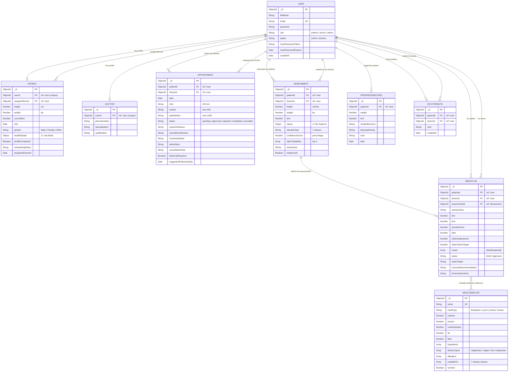

---

## 📡 API Reference

> Full interactive API documentation is available at `/api-docs` when the backend is running (Swagger UI with OpenAPI 3.0.3).

### Authentication (Public)
| Method | Endpoint | Description |
|---|---|---|
| `POST` | `/api/auth/register` | Patient self-registration |
| `POST` | `/api/auth/login` | JWT authentication |
| `POST` | `/api/auth/reset-password` | Token-based password reset |

### Admin Routes (Admin only)
| Method | Endpoint | Description |
|---|---|---|
| `GET/POST` | `/api/admin/doctors` | List / Create doctors |
| `GET/PUT/DELETE` | `/api/admin/doctors/:id` | Get / Update / Delete doctor |
| `PATCH` | `/api/admin/doctors/:id/status` | Toggle doctor active/inactive |
| `GET` | `/api/admin/patients` | List all patients |
| `GET/DELETE` | `/api/admin/patients/:id` | Get / Delete patient |
| `PATCH` | `/api/admin/patients/:id/status` | Toggle patient status |
| `PATCH` | `/api/admin/patients/:id/assign-doctor` | Assign doctor to patient |
| `GET` | `/api/admin/appointments` | List all appointments |
| `PATCH` | `/api/admin/appointments/:id/status` | Approve / Reject / Cancel |
| `PUT` | `/api/admin/appointments/:id/reschedule` | Reschedule appointment |
| `POST` | `/api/admin/reports/generate` | Generate system reports |

### Doctor Routes (Doctor only)
| Method | Endpoint | Description |
|---|---|---|
| `GET` | `/api/doctor/patients` | List assigned patients |
| `GET` | `/api/doctor/patients/:id` | Full patient details |
| `PUT` | `/api/doctor/patients/:id/health-details` | Update health details |
| `POST` | `/api/doctor/patients/:id/notes` | Add doctor note |
| `PUT` | `/api/doctor/patients/:id/notes/:noteId` | Update doctor note |
| `GET` | `/api/doctor/appointments` | Doctor's appointments |
| `PUT` | `/api/doctor/appointments/:id/complete` | Complete appointment |
| `GET` | `/api/doctor/assessments` | List assessments |
| `GET` | `/api/doctor/assessments/:id` | Get assessment details |
| `POST` | `/api/doctor/assessments/predict` | ML obesity prediction |
| `POST` | `/api/doctor/assessments/save` | Save assessment result |
| `GET` | `/api/doctor/meal-plans` | List meal plans |
| `GET` | `/api/doctor/meal-plans/:id` | Get meal plan details |
| `POST` | `/api/doctor/meal-plans` | Save draft meal plan |
| `POST` | `/api/doctor/meal-plans/generate` | Generate suggested meals |
| `POST` | `/api/doctor/meal-plans/alternatives` | Get alternative meals |
| `PUT` | `/api/doctor/meal-plans/:id` | Update draft |
| `POST` | `/api/doctor/meal-plans/:id/approve` | Approve meal plan |
| `GET` | `/api/doctor/reports/patients` | List assignable patients |
| `GET` | `/api/doctor/reports/generate` | Generate patient report |

### Patient Routes (Patient only)
| Method | Endpoint | Description |
|---|---|---|
| `GET` | `/api/patient/appointments` | Patient's appointments |
| `GET` | `/api/patient/appointments/doctors` | List active doctors |
| `POST` | `/api/patient/appointments` | Request appointment |
| `PUT` | `/api/patient/appointments/:id/cancel` | Cancel appointment |
| `GET` | `/api/patient/assessments` | View assessments |
| `GET` | `/api/patient/meal-plans` | View approved meal plans |
| `GET` | `/api/patient/progress` | Get progress records |
| `POST` | `/api/patient/progress` | Log progress entry |
| `PUT` | `/api/patient/progress/:id` | Update progress entry |
| `GET` | `/api/patient/reports/generate` | Generate personal report |

### Dashboard & Documentation
| Method | Endpoint | Description |
|---|---|---|
| `GET` | `/api/dashboard/admin` | Admin dashboard metrics |
| `GET` | `/api/dashboard/doctor` | Doctor dashboard metrics |
| `GET` | `/api/dashboard/patient` | Patient dashboard metrics |
| `GET` | `/api-docs` | Swagger UI documentation |
| `GET` | `/api-docs.json` | OpenAPI 3.0.3 JSON spec |

**Total: 42+ API endpoints**

---

## 🔄 System Workflows

### 1. Authentication Sequence

> Source: `backend/controllers/authController.js`, `backend/middleware/authMiddleware.js`, `frontend/src/services/apiClient.js`, `frontend/src/components/ProtectedRoute.jsx`, `backend/models/User.js`

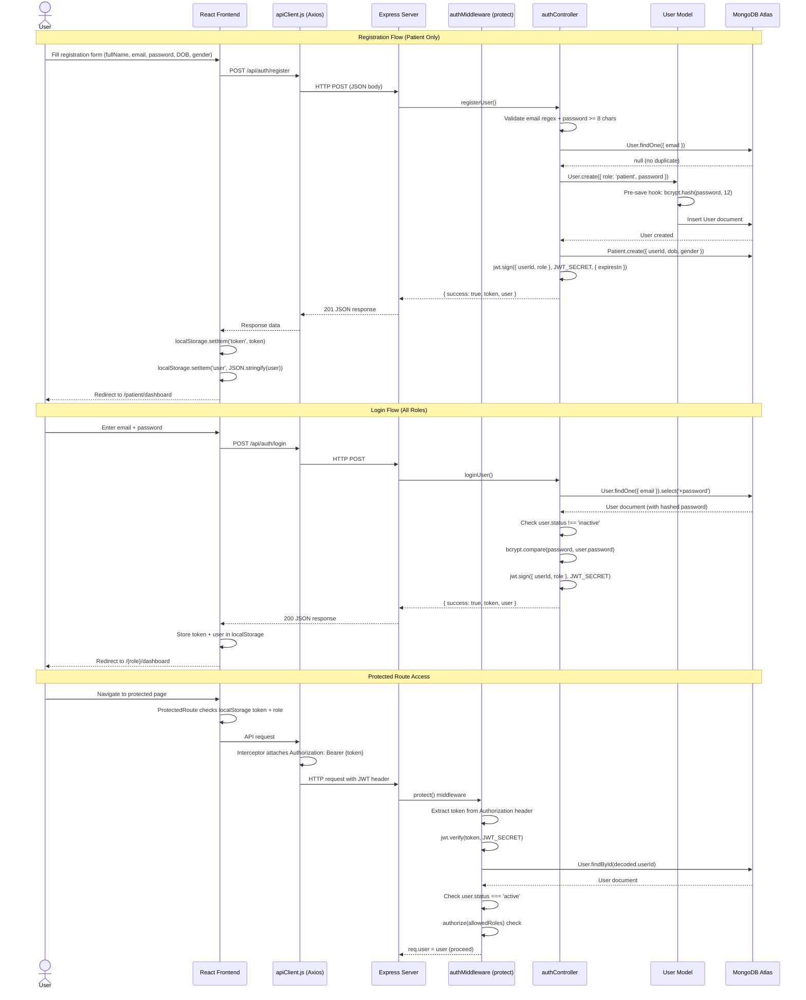

---

### 2. Obesity Prediction Sequence

> Source: `backend/controllers/assessmentController.js`, `ml-service/app.py`, `frontend/src/pages/doctor/NewAssessment.jsx`

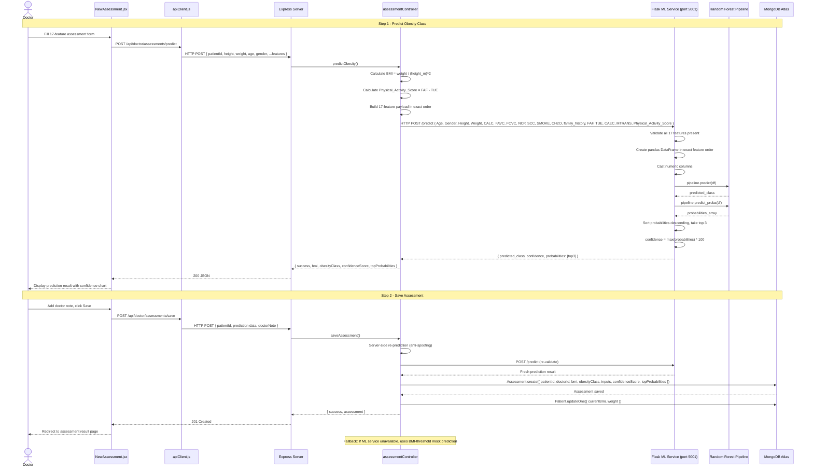

---

### 3. Appointment Workflow Sequence

> Source: `backend/controllers/patientAppointmentController.js`, `backend/controllers/adminController.js`, `backend/controllers/doctorAppointmentController.js`, `backend/models/Appointment.js`

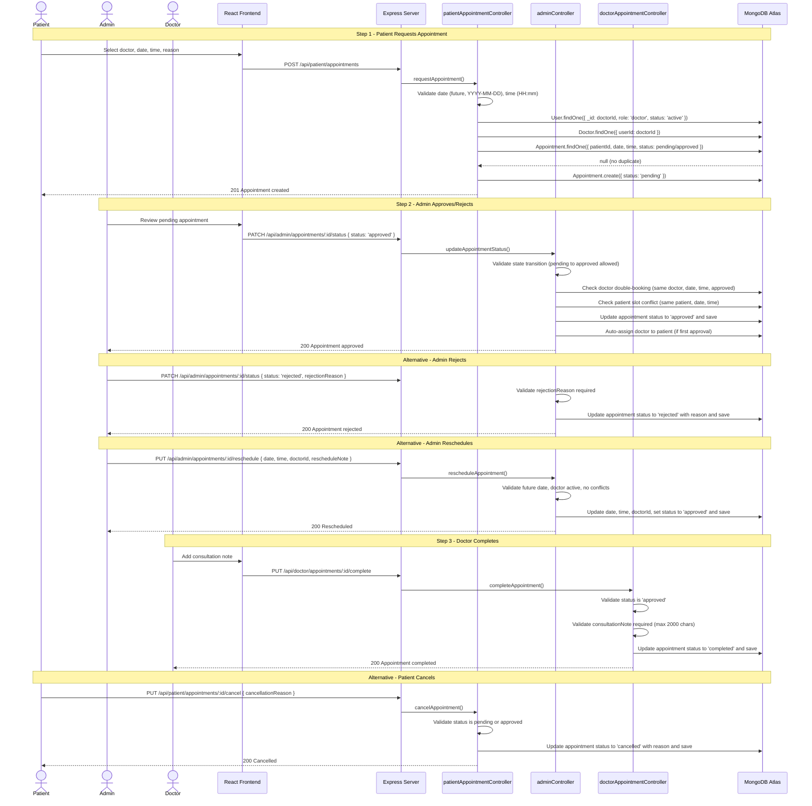

---

### 4. Health Record / Progress Tracking Sequence

> Source: `backend/controllers/patientProgressController.js`, `backend/controllers/doctorPatientController.js`, `backend/models/ProgressRecord.js`, `backend/models/Patient.js`

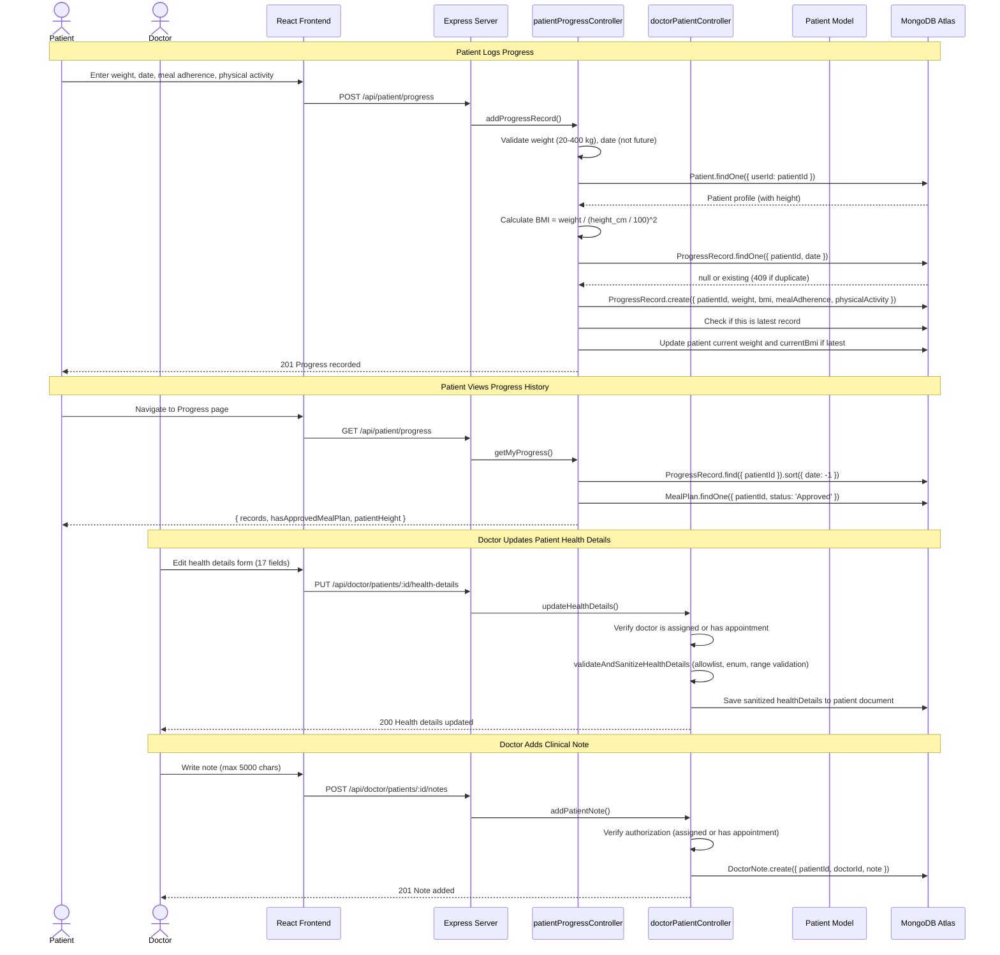

---

### 5. Meal Plan Generation Sequence

> Source: `backend/controllers/mealPlanController.js`, `backend/models/MealPlan.js`, `backend/models/MealTemplate.js`, `frontend/src/pages/doctor/MealPlanGenerator.jsx`

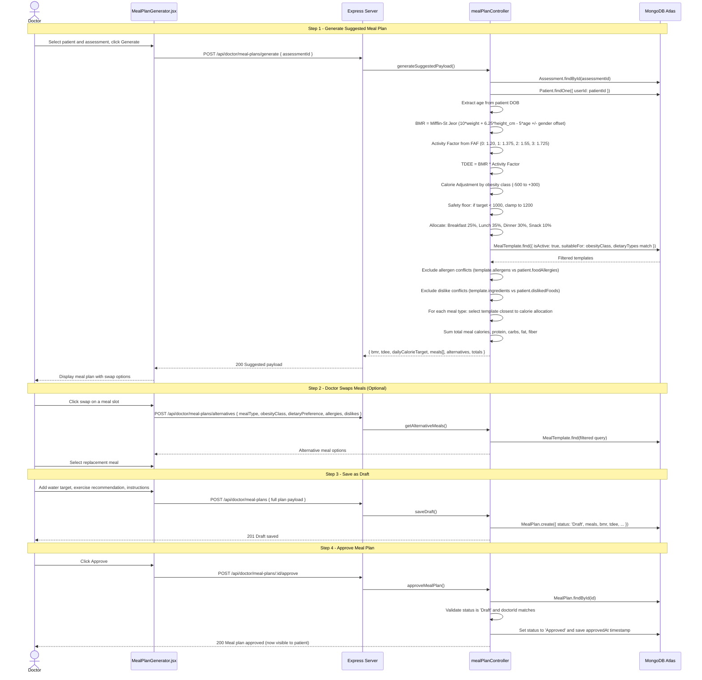

---

## 🤖 Machine Learning Module

### Model Specification
| Attribute | Value |
|---|---|
| **Algorithm** | Random Forest (sklearn Pipeline) |
| **Model File** | `final_obesity_random_forest_pipeline.joblib` (19.5 MB) |
| **Framework** | scikit-learn 1.6.1 |
| **Deployment** | Flask microservice (port 5001) |
| **Classification** | 7-class multi-class |

### Obesity Classes
| Class | Description |
|---|---|
| `Insufficient_Weight` | Underweight |
| `Normal_Weight` | Normal BMI range |
| `Overweight_Level_I` | Mild overweight |
| `Overweight_Level_II` | Moderate overweight |
| `Obesity_Type_I` | Obesity class I |
| `Obesity_Type_II` | Obesity class II |
| `Obesity_Type_III` | Obesity class III (severe) |

### 17 Input Features
| # | Feature | Description | Type |
|---|---|---|---|
| 1 | Age | Patient age | Numeric |
| 2 | Gender | Male / Female | Categorical |
| 3 | Height | Height in metres | Numeric |
| 4 | Weight | Weight in kilograms | Numeric |
| 5 | CALC | Alcohol consumption frequency | Categorical |
| 6 | FAVC | High-calorie food consumption | Binary |
| 7 | FCVC | Vegetable consumption frequency (1–3) | Numeric |
| 8 | NCP | Main meals per day (1–4) | Numeric |
| 9 | SCC | Calorie monitoring | Binary |
| 10 | SMOKE | Smoking status | Binary |
| 11 | CH2O | Daily water intake (1–3 litres) | Numeric |
| 12 | family_history_with_overweight | Family history of overweight | Binary |
| 13 | FAF | Physical activity frequency (0–3 days) | Numeric |
| 14 | TUE | Technology usage time (0–24 hours) | Numeric |
| 15 | CAEC | Food between meals frequency | Categorical |
| 16 | MTRANS | Primary transportation method | Categorical |
| 17 | Physical_Activity_Score | Derived: FAF – TUE | Computed |

### Prediction Pipeline
```
Doctor Form → Backend Validation → Feature Engineering (Physical_Activity_Score)
  → HTTP POST to Flask /predict → sklearn Pipeline.predict() + predict_proba()
  → Returns: predicted_class + confidence% + top 3 probabilities
  → Stored in Assessment collection
```

The backend includes a **fallback mock predictor** for when the ML service is unavailable, using BMI-threshold-based classification.

---

## 🧮 Health Calculation Engine

### Body Mass Index (BMI)
```
BMI = weight(kg) / height(m)²
```

### Basal Metabolic Rate (Mifflin-St Jeor Equation)
```
Male:   BMR = (10 × weight) + (6.25 × height_cm) − (5 × age) + 5
Female: BMR = (10 × weight) + (6.25 × height_cm) − (5 × age) − 161
```

### Total Daily Energy Expenditure (TDEE)
```
TDEE = BMR × Activity Factor
```

| Physical Activity (FAF) | Activity Factor | Level |
|---|---|---|
| 0 days/week | 1.20 | Sedentary |
| 1 day/week | 1.375 | Lightly Active |
| 2 days/week | 1.55 | Moderately Active |
| 3 days/week | 1.725 | Very Active |

### Calorie Adjustment by Obesity Classification
| Classification | Daily Calorie Adjustment |
|---|---|
| Insufficient Weight | TDEE + 300 kcal (surplus) |
| Normal Weight | TDEE (maintenance) |
| Overweight Level I | TDEE − 300 kcal (deficit) |
| Overweight Level II | TDEE − 400 kcal (deficit) |
| Obesity Type I–III | TDEE − 500 kcal (deficit) |

> Safety floor: if calculated target drops below 1000 kcal, it is clamped to 1200 kcal.

---

## 🍽 Meal Plan Generation System

The meal plan engine is a **database-driven, rule-based recommendation system** (not ML-driven):

1. **Calculate** BMR → TDEE → adjusted daily calorie target based on obesity class
2. **Allocate** calories per meal type: Breakfast (25%), Lunch (35%), Dinner (30%), Snack (10%)
3. **Query** `MealTemplate` collection with filters:
   - `isActive: true`
   - `suitableFor` includes patient's obesity class
   - `dietaryTypes` matches preference (Vegan / Vegetarian / No Special Preference)
4. **Exclude** meals containing patient's allergens or disliked food ingredients
5. **Select** closest calorie match per meal slot
6. **Allow** doctor to swap individual meals from filtered alternatives
7. **Save** as Draft → Doctor reviews → **Approve** to make visible to patient

---

## 🧩 Software Components

### Component Diagram

> Source: `backend/index.js`, `backend/middleware/authMiddleware.js`, all route files, all controller files, `frontend/src/router/AppRouter.jsx`, `frontend/src/layouts/`, `ml-service/app.py`

```mermaid
flowchart TB
    subgraph FrontendLayer["Frontend Layer (React 19 + Vite 8)"]
        subgraph Pages["Page Components (24)"]
            AdminPages["Admin Pages (5): Dashboard, Doctors, Patients, Appointments, Reports"]
            DoctorPages["Doctor Pages (10): Dashboard, Patients, PatientDetail, Appointments, Assessments, NewAssessment, AssessmentResult, MealPlanList, MealPlanGenerator, Reports"]
            PatientPages["Patient Pages (6): Dashboard, Appointments, Assessments, MealPlans, Progress, Reports"]
            AuthPages["Auth Pages (3): Login, Register, ResetPassword"]
        end
        subgraph FEComponents["Shared Components"]
            ProtectedRoute["ProtectedRoute (Role Guard)"]
            DashboardLayout["DashboardLayout (Sidebar + Header)"]
            AuthLayout["AuthLayout"]
            Modals["Admin Modals (8): Approve, Reject, Cancel, Reschedule, View, Doctor, Patient modals"]
            DashboardWidgets["Dashboard Widgets: SummaryCard, ChartPanel, EmptyState, LoadingDashboard, DashboardError"]
        end
        subgraph FEServices["Frontend Services"]
            ApiClient["apiClient.js (Axios + JWT Interceptor)"]
            PdfExport["pdfExport.js (html2pdf.js + oklch converter)"]
        end
        Router["AppRouter.jsx (React Router DOM v7)"]
    end

    subgraph BackendLayer["Backend Layer (Express 5 + Node.js 20)"]
        subgraph Middleware["Middleware"]
            CORS["cors()"]
            JSONParser["express.json()"]
            AuthMW["authMiddleware: protect() + authorize()"]
        end
        subgraph Routes["Route Layer (13 route files)"]
            AuthRoutes["authRoutes: /api/auth"]
            AdminRoutes["adminRoutes: /api/admin"]
            DashboardRoutes["dashboardRoutes: /api/dashboard"]
            DoctorPatientRoutes["doctorPatientRoutes: /api/doctor/patients"]
            DoctorApptRoutes["doctorAppointmentRoutes: /api/doctor/appointments"]
            AssessmentRoutes["assessmentRoutes: /api/doctor/assessments"]
            MealPlanRoutes["mealPlanRoutes: /api/doctor/meal-plans"]
            ReportRoutes["reportRoutes: /api/doctor/reports"]
            PatientApptRoutes["patientAppointmentRoutes: /api/patient/appointments"]
            PatientAssessRoutes["patientAssessmentRoutes: /api/patient/assessments"]
            PatientMealRoutes["patientMealPlanRoutes: /api/patient/meal-plans"]
            PatientProgressRoutes["patientProgressRoutes: /api/patient/progress"]
            PatientReportRoutes["patientReportRoutes: /api/patient/reports"]
        end
        subgraph ControllerLayer["Controller Layer (13 files)"]
            Controllers["authController, adminController, dashboardController, assessmentController, mealPlanController, doctorPatientController, doctorAppointmentController, patientAppointmentController, patientProgressController, reportController, patientReportController, patientAssessmentController, patientMealPlanController"]
        end
        subgraph ServiceLayer["Service Layer"]
            EmailSvc["emailService.js (Nodemailer)"]
        end
        subgraph ModelLayer["Data Model Layer (9 Mongoose Schemas)"]
            ModelsAll["User, Patient, Doctor, Appointment, Assessment, MealPlan, MealTemplate, ProgressRecord, DoctorNote"]
        end
        SwaggerDocs["swagger.js (OpenAPI 3.0.3 Spec)"]
    end

    subgraph MLLayer["ML Service Layer (Flask + Python 3.11)"]
        FlaskApp["Flask App (app.py)"]
        HealthEndpoint["/health (GET)"]
        PredictEndpoint["/predict (POST)"]
        RFModel["Random Forest Pipeline (joblib)"]
    end

    subgraph DataLayer["Data Layer"]
        MongoDB["MongoDB Atlas (Cloud)"]
        SMTP["SMTP Server"]
    end

    Router --> Pages
    Pages --> FEComponents
    FEComponents --> ApiClient
    ApiClient -- "HTTP/JWT" --> Middleware
    Middleware --> Routes
    Routes --> ControllerLayer
    ControllerLayer --> ModelLayer
    ControllerLayer --> ServiceLayer
    ModelLayer -- "Mongoose ODM" --> MongoDB
    ServiceLayer -- "SMTP" --> SMTP
    ControllerLayer -- "HTTP POST" --> PredictEndpoint
    PredictEndpoint --> RFModel
```

---

## 📊 Data Flow

### Data Flow Diagram

> Source: All controllers, `apiClient.js`, `app.py`, `authMiddleware.js`

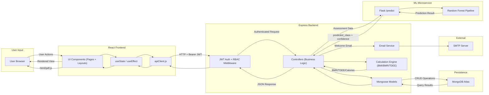

---

## 🚀 Getting Started

### Prerequisites

- **Node.js** ≥ 20.x
- **Python** ≥ 3.11
- **MongoDB Atlas** account (or local MongoDB)
- **Docker** + **Docker Compose** (for containerized deployment)

### Local Development Setup

**1. Clone the repository**
```bash
git clone https://github.com/<your-username>/obesity-management.git
cd obesity-management
```

**2. Configure environment variables**
```bash
cp .env.example .env
cp backend/.env.example backend/.env
# Edit backend/.env with your MongoDB URI and JWT secret
```

**3. Install all dependencies**
```bash
npm run install-all
```
This installs root, backend, frontend, and ML service dependencies concurrently.

**4. Seed the meal template database**
```bash
cd backend
node scripts/seedMealTemplates.js
```

**5. Start all services in development mode**
```bash
# From root directory
npm run dev
```
This runs the backend (port 5000), frontend (port 5173), and ML service (port 5001) concurrently.

**6. Access the application**
| Service | URL |
|---|---|
| Frontend | http://localhost:5173 |
| Backend API | http://localhost:5000/api |
| Swagger Docs | http://localhost:5000/api-docs |
| ML Service Health | http://localhost:5001/health |

---

## ⚙ Environment Variables

### Backend (`backend/.env`)
| Variable | Required | Default | Description |
|---|---|---|---|
| `PORT` | No | `5000` | Backend server port |
| `NODE_ENV` | No | `development` | Environment mode |
| `MONGODB_URI` | **Yes** | – | MongoDB Atlas connection string |
| `JWT_SECRET` | **Yes** | – | JWT signing secret (min 32 chars) |
| `JWT_EXPIRES_IN` | No | `7d` | Token expiry duration |
| `ML_SERVICE_URL` | No | `http://localhost:5001` | ML microservice URL |
| `CLIENT_URL` | No | `http://localhost:5173` | Frontend URL (for email links) |
| `SMTP_HOST` | No | – | SMTP server host |
| `SMTP_PORT` | No | `587` | SMTP server port |
| `SMTP_USER` | No | – | SMTP username |
| `SMTP_PASS` | No | – | SMTP password |
| `EMAIL_FROM` | No | `noreply@obesitycare.hospital.lk` | Sender email address |

### Frontend (`frontend/.env`)
| Variable | Required | Default | Description |
|---|---|---|---|
| `VITE_API_URL` | No | `http://localhost:5000/api` | Backend API base URL |

### ML Service
| Variable | Required | Default | Description |
|---|---|---|---|
| `ML_PORT` | No | `5001` | Flask server port |

---

## 🐳 Deployment

### Deployment Diagram

> Source: `docker-compose.yml`, `backend/Dockerfile`, `frontend/Dockerfile`, `ml-service/Dockerfile`, `frontend/nginx.conf`

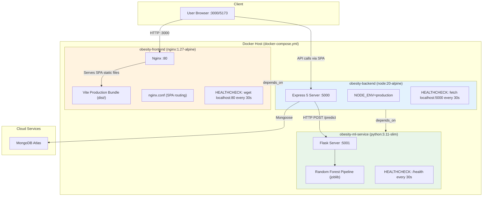

### Docker Compose (Recommended)

```bash
# Build and start all 3 services
docker compose up --build -d

# View logs
docker compose logs -f

# Stop services
docker compose down
```

| Container | Port Mapping | Base Image |
|---|---|---|
| `obesity-ml-service` | 5001:5001 | python:3.11-slim |
| `obesity-backend` | 5000:5000 | node:20-alpine |
| `obesity-frontend` | 3000:80 | nginx:1.27-alpine |

**Dependency chain**: `frontend` → `backend` → `ml-service`

All containers include health checks with 30s intervals.

### Production Frontend
The frontend Dockerfile uses a **multi-stage build**:
1. **Builder stage** — Node.js 20 installs dependencies and builds the Vite production bundle
2. **Runner stage** — Nginx 1.27-alpine serves the compiled SPA with custom routing configuration

---

## 🔄 CI/CD Pipeline

The project includes a comprehensive GitHub Actions CI pipeline (`.github/workflows/ci.yml`) with 5 parallel verification stages:

| Stage | Actions |
|---|---|
| **Frontend CI** | Oxlint linting → Vite production build → Artifact upload |
| **Backend CI** | JavaScript syntax validation (all files) → Swagger OpenAPI spec verification (40+ paths) |
| **ML Service CI** | Python compilation → Model deserialization and integrity check |
| **Docker Validation** | Docker Compose configuration syntax validation |
| **Quality Gate** | All 4 stages must pass before merge |

Triggers: push to `main`/`master`, pull requests, manual dispatch. Concurrent runs on the same branch/PR cancel older runs.

---

## 📁 Project Structure

### Project Structure Diagram

```
obesity-management/
├── .github/
│   └── workflows/
│       └── ci.yml                           # GitHub Actions CI pipeline (5 stages)
├── .gitignore
├── .env.example                             # Root environment template
├── docker-compose.yml                       # 3-service Docker orchestration
├── package.json                             # Root monorepo scripts (concurrently)
│
├── backend/                                 # Node.js / Express 5 REST API
│   ├── index.js                             # Server entry point + middleware + route mounting
│   ├── package.json                         # Backend dependencies
│   ├── Dockerfile                           # node:20-alpine production image
│   ├── .env.example                         # Backend environment template
│   ├── config/
│   │   └── dbConnection.js                  # Mongoose MongoDB Atlas connection
│   ├── middleware/
│   │   └── authMiddleware.js                # JWT protect() + authorize(roles) middleware
│   ├── models/                              # 9 Mongoose schemas
│   │   ├── User.js                          # Auth identity (bcrypt pre-save hook)
│   │   ├── Patient.js                       # Patient profile + 17 healthDetails sub-fields
│   │   ├── Doctor.js                        # Doctor profile (specialisation, qualification)
│   │   ├── Appointment.js                   # 5-status lifecycle (pending→approved→completed)
│   │   ├── Assessment.js                    # ML prediction storage (7 obesity classes)
│   │   ├── MealPlan.js                      # Personalized nutrition plan (Draft→Approved)
│   │   ├── MealTemplate.js                  # Meal database (dietary types, allergens, suitableFor)
│   │   ├── ProgressRecord.js                # Patient weight/BMI tracking
│   │   └── DoctorNote.js                    # Clinical notes
│   ├── controllers/                         # 13 controller files (business logic)
│   │   ├── authController.js                # Register, login, resetPassword
│   │   ├── adminController.js               # Doctor/Patient/Appointment/Report management (1192 lines)
│   │   ├── dashboardController.js           # Admin/Doctor/Patient dashboard metrics
│   │   ├── assessmentController.js          # ML prediction + save (with anti-spoofing re-prediction)
│   │   ├── mealPlanController.js            # BMR/TDEE calculation + meal generation engine
│   │   ├── doctorPatientController.js       # Patient details, health details, doctor notes
│   │   ├── doctorAppointmentController.js   # Appointment completion with consultation notes
│   │   ├── patientAppointmentController.js  # Request, cancel, list doctors
│   │   ├── patientProgressController.js     # Log/update weight with auto BMI calculation
│   │   ├── reportController.js              # Doctor-scoped patient reports (4 types)
│   │   ├── patientReportController.js       # Patient self-service reports (4 types)
│   │   ├── patientAssessmentController.js   # View own assessments
│   │   └── patientMealPlanController.js     # View approved meal plans + alternatives
│   ├── routes/                              # 13 route files (Express Router)
│   ├── services/
│   │   └── emailService.js                  # Nodemailer doctor welcome email (HTML template)
│   ├── scripts/
│   │   ├── seedMealTemplates.js             # Meal template database seeder
│   │   ├── verifyMath.js                    # Math verification utility
│   │   ├── testSchema.js                    # Schema validation utility
│   │   └── dryRunRecovery.js                # Recovery dry-run utility
│   └── docs/
│       └── swagger.js                       # OpenAPI 3.0.3 specification (106 KB)
│
├── frontend/                                # React 19 SPA (Vite 8)
│   ├── index.html                           # HTML entry point
│   ├── package.json                         # Frontend dependencies
│   ├── Dockerfile                           # Multi-stage: Vite build → Nginx 1.27
│   ├── nginx.conf                           # SPA routing configuration
│   ├── vite.config.js                       # Vite + React + TailwindCSS v4 plugins
│   └── src/
│       ├── main.jsx                         # React 19 createRoot entry
│       ├── App.jsx                          # Root component → AppRouter
│       ├── index.css                        # Global styles (TailwindCSS v4)
│       ├── router/
│       │   └── AppRouter.jsx                # 24 route definitions + RootRedirect
│       ├── services/
│       │   └── apiClient.js                 # Axios instance + JWT interceptor + 401/403 handler
│       ├── utils/
│       │   └── pdfExport.js                 # html2pdf.js with oklch/oklab color conversion (363 lines)
│       ├── components/
│       │   ├── ProtectedRoute.jsx           # Role-based route guard
│       │   ├── admin/                       # 8 modal components (Approve, Reject, Cancel, Reschedule, View, Doctor, Patient modals)
│       │   └── dashboard/                   # 7 shared widgets (SummaryCard, ChartPanel, EmptyState, etc.)
│       ├── layouts/
│       │   ├── AuthLayout.jsx               # Login/Register layout
│       │   └── DashboardLayout.jsx          # Sidebar + Header layout
│       └── pages/
│           ├── LoginPage.jsx                # JWT login form
│           ├── RegisterPage.jsx             # Patient registration form
│           ├── ResetPasswordPage.jsx        # Token-based password reset
│           ├── admin/                       # 5 admin pages
│           ├── doctor/                      # 10 doctor pages
│           └── patient/                     # 6 patient pages
│
├── ml-service/                              # Python Flask ML microservice
│   ├── app.py                               # Flask server: /health + /predict endpoints
│   ├── requirements.txt                     # Python dependencies (6 packages)
│   ├── Dockerfile                           # python:3.11-slim production image
│   └── models/
│       └── final_obesity_random_forest_pipeline.joblib  # Pre-trained RF model (19.5 MB)
│
└── database-recovery/                       # Recovery directory (empty)
```

---

## 🔀 Feature Workflow

### Feature Workflow Diagram

> Source: `frontend/src/router/AppRouter.jsx`, all controllers

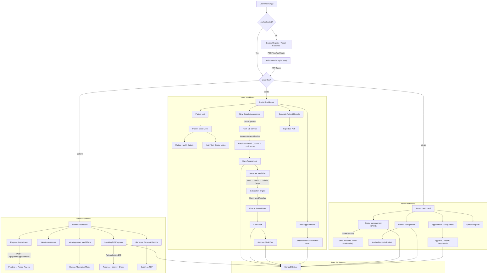

---

## 📊 Key Metrics

| Metric | Count |
|---|---|
| API Endpoints | 42+ |
| Database Models | 9 |
| Frontend Pages | 24 |
| Frontend Components | 15+ |
| ML Input Features | 17 |
| Obesity Classes | 7 |
| User Roles | 3 |
| Docker Containers | 3 |
| CI Pipeline Stages | 5 |
| Report Types | 9 (across all roles) |

---

## ✅ Diagram Verification

| Diagram | Required | Generated | Source Evidence | Status |
|---|---|---|---|---|
| System Architecture | Yes | ✅ Yes | `docker-compose.yml`, `index.js`, `app.py`, `apiClient.js`, `AppRouter.jsx` | ✅ Verified |
| ER Diagram | Yes | ✅ Yes | All 9 model files in `backend/models/` | ✅ Verified |
| Use Case Diagram | Yes | ✅ Yes | All route files, all controllers, `AppRouter.jsx`, `authMiddleware.js` | ✅ Verified |
| Authentication Sequence | Yes (JWT implemented) | ✅ Yes | `authController.js`, `authMiddleware.js`, `apiClient.js`, `ProtectedRoute.jsx`, `User.js` | ✅ Verified |
| ML Prediction Sequence | Yes (ML implemented) | ✅ Yes | `assessmentController.js`, `app.py`, `NewAssessment.jsx` | ✅ Verified |
| Appointment Sequence | Yes (implemented) | ✅ Yes | `patientAppointmentController.js`, `adminController.js`, `doctorAppointmentController.js`, `Appointment.js` | ✅ Verified |
| Health Record Sequence | Yes (implemented) | ✅ Yes | `patientProgressController.js`, `doctorPatientController.js`, `ProgressRecord.js`, `Patient.js` | ✅ Verified |
| Meal Recommendation Sequence | Yes (implemented) | ✅ Yes | `mealPlanController.js`, `MealPlan.js`, `MealTemplate.js`, `MealPlanGenerator.jsx` | ✅ Verified |
| Component Diagram | Yes | ✅ Yes | `index.js`, `authMiddleware.js`, all routes, all controllers, `AppRouter.jsx`, layouts, `app.py` | ✅ Verified |
| Data Flow Diagram | Yes | ✅ Yes | All controllers, `apiClient.js`, `app.py`, `authMiddleware.js` | ✅ Verified |
| Deployment Diagram | Yes (Docker verified) | ✅ Yes | `docker-compose.yml`, 3 Dockerfiles, `nginx.conf` | ✅ Verified |
| Project Structure | Yes | ✅ Yes | Full repository tree inspection | ✅ Verified |
| Feature Workflow | Yes | ✅ Yes | `AppRouter.jsx`, all controllers, all page components | ✅ Verified |

> **All 13 diagrams generated. All verified against source code. No invented components, relationships, or flows.**

---

<p align="center">
  <strong>Built with ❤️ as a Software Engineering Final-Year Project</strong>
</p>
